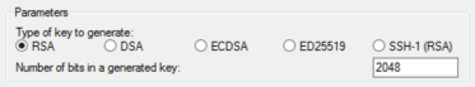
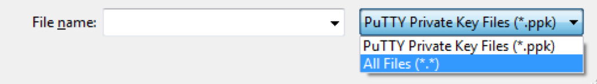
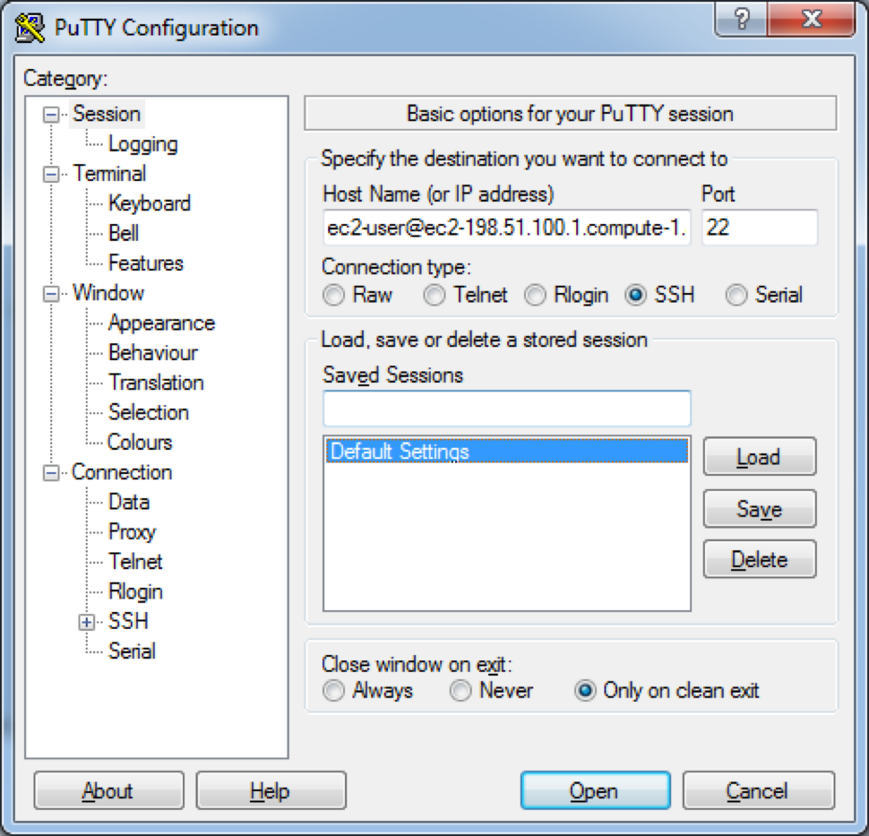

You have been sent a key file called cXX.pem, where XX is a number unique to your account. You will need this number for all the commands below. You will also need a username, which is "userXX", where XX is the same unique number on your key file. The examples will below be for the user "user28", with the key "c28" - you will need to replace 28 with your own, unique number.


##Windows users

###1. Create a windows key
We need to convert the key file to a format that is compatible with Windows. We do this using PuTTYGen.

- Start PuTTYgen (for example, from the Start menu, choose **All Programs > PuTTY > PuTTYgen**).

- Under Type of key to generate, choose **RSA**.

<div align="center">

</div>

- Choose **Load**. By default, PuTTYgen displays only files with the extension .ppk. To locate your .pem file, select the option to display files of all types.

<div align="center">

</div>

- Select your .pem file that we sent you, and then choose **Open**. Choose **OK** to dismiss the confirmation dialog box.

- Choose **Save private key** to save the key in the format that PuTTY can use. PuTTYgen displays a warning about saving the key without a passphrase. Choose **Yes**.

- Specify the same name for the key that we have given you (e.g. **c28**. PuTTY automatically adds the .ppk file extension.

- Your private key is now in the correct format for use with PuTTY. You can now connect to your instance using PuTTY's SSH client.

###2. Starting a PuTTY session

- Start PuTTY (from the Start menu, choose **All Programs > PuTTY > PuTTY**)

- In the Category pane, select *Session*
- In the Host Name box, enter your username(e.g., "user28"), followed by '@', followed by the public DNS name. This changes each day and we will email it to you. In total you will have something like user28@ec2-54-187-83-150.us-west-2.compute.amazonaws.com
- Under *Connection type*, select *SSH*.
- Ensure that the *port* is *22*

<div align="center">

</div>

- In the Category pane, expand *Connection*, expand *SSH*, and then select *Auth*.
- Choose Browse.
- Select the .ppk file that you generated using PuTTYGen, and then choose *Open*.
- Choose *Open* to start the PuTTY session.
- If this is the first time you have connected to this instance, PuTTY displays a security alert dialog box that asks whether you trust the host you are connecting to. Choose yes.


##Mac and Linux Users

- Open a terminal (on Mac, cmd + space, then type "terminal" and press "enter")
- Change your working directory to the folder containg your .pem file, using `cd`. Something like:

```{r eval = F}
cd ~/Documents/PopGenCanada
```

Now use your username and the public DNS (this will be emailed to you each day) to log onto the server via SSH.  The command will be something like the following (for user "user28"):

```{r eval = F}
ssh -i c28.pem user28@ec2-54-187-83-150.us-west-2.compute.amazonaws.com

```
