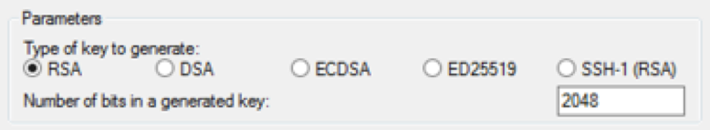

##Everyone
1. Log onto the Amazon server using your username and keyfile, as you did yesterday.

2. We are going to create a new text file using the `nano` text editor. In the amazon server, type:

```{r}
nano
```

3. Type some text into nano, then press ctrl+X to exit. Type "Y" to save, then when prompted name your file "test.txt", then <enter>.

4. Use `ls` to check that the test.txt file has appeared. 

Our next step differs for windows and mac users. Go to the relevant section.

##Windows users
- Start up your command prompt (e.g. open windows explorer and type "cmd" into the explorer bar and press <enter>)

- Get the path to your current directory, and to your key file:

```{r, eval = F}
pscp - C:\Documents\path\to_your_file\physaliaXX.pkk
```

###1. Create a windows key
We need to convert the key file to a format that is compatible with Windows. We do this using PuTTYGen.

- Start PuTTYgen (for example, from the Start menu, choose **All Programs > PuTTY > PuTTYgen**).

- Under Type of key to generate, choose **RSA**.

<div align="center">

</div>

- Choose **Load**. By default, PuTTYgen displays only files with the extension .ppk. To locate your .pem file, select the option to display files of all types.

<div align="center">

</div>

- Select your .pem file that we sent you, and then choose **Open**. Choose **OK** to dismiss the confirmation dialog box.

- Choose **Save private key** to save the key in the format that PuTTY can use. PuTTYgen displays a warning about saving the key without a passphrase. Choose **Yes**.

- Specify the same name for the key that we have given you (e.g. **physalia28**. PuTTY automatically adds the .ppk file extension.

- Your private key is now in the correct format for use with PuTTY. You can now connect to your instance using PuTTY's SSH client.

###2. Starting a PuTTY session

- Start PuTTY (from the Start menu, choose **All Programs > PuTTY > PuTTY**)

- In the Category pane, select *Session*
- In the Host Name box, enter your username(e.g., physalia28), followed by "@", followed by the public DNS name. This changes each day and we will email it to you. In total you will have something like physalia28@ec2-54-187-83-150.us-west-2.compute.amazonaws.com
- Under *Connection type*, select *SSH*.
- Ensure that the *port* is *22*

<div align="center">

</div>

- In the Category pane, expand *Connection*, expand *SSH*, and then select *Auth*.
- Choose Browse.
- Select the .ppk file that you generated using PuTTYGen, and then choose *Open*.
- Choose *Open* to start the PuTTY session.
- If this is the first time you have connected to this instance, PuTTY displays a security alert dialog box that asks whether you trust the host you are connecting to. Choose yes.


##Mac and Linux Users

- Open a terminal (on Mac, cmd + space, then type "terminal" and press <enter>)
- Change your working directory to the folder containg your .pem phylia, using `cd`. Something like:

```{r eval = F}
cd ~/Documents/PopGenBerlin
```

Now use your username and the public DNS (this will be emailed to you each day) to log onto the server via SSH.  The command will be something like the following (for user physalia 28):

```{r eval = F}
ssh -i physalia28.pem physalia28@ec2-54-187-83-150.us-west-2.compute.amazonaws.com

```
