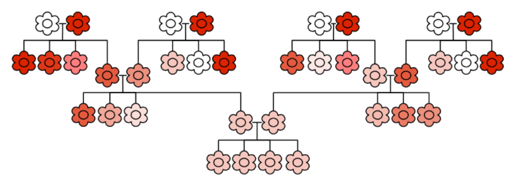

```{r setup, include=FALSE}
knitr::opts_chunk$set(echo = FALSE)
```

##Outline
- Historical overview
- How much genetic variation exists in populations?
- Genetic diversity in the genomic era
- Software and tools


#Historical overview


## Darwin and genetic diversity

**Darwin’s four postulates in the Origin of Species (1859)**

<div class = "columns-2">

1. Individuals within species are variable
2. Some variations are passed on to offspring
3. In every generation more offspring are produced than can survive
4. Individuals who survive and go on to reproduce are naturally selected.


</div>


## Darwin and heritable variation

- Natural selection based on heritable variation within populations
- Darwin believed in blending inheritance
- But this leads to homgenisation

<div align = "center">

</div>


## Particulate inheritance

Gregor Mendel (1866): three“laws”

- Individuals possess two alleles at each gene
- Genes for separate traits are passed on independently
- Recessive alleles are masked by dominance alleles

<div align = "center">

</div>


## The modern synthesis
<div align = "center">

</div>


## The modern synthesis

<br>

- Evolution can be defined as a change in allele frequencies within populations over generations
- Evolution occurs as a result of mutation, drift, gene flow and selection


## Population genetics

<br> 

- How much variation exists within and across populations?
- What forces explain this variation?
- These questions are addressed using mathematical models, natural population sampling and experiments


# How much genetic variation exists in populations?


## How much genetic variation exists in populations?

<br>

- How do we define and measure genetic variation?
- How do we predict how much genetic variation should occur in populations?
- How can we tell what evolutionary forces are acting on a gene? (later in the course)


## How do we define genetic variation?

<br>

**How we calculate genetic diversity depends on:**

- Our biological question
- Our measurement method

<br>

**This is best illustrated using case studies**


## Genetic variation in populations

<div align = "left">

</div>


## Genetic variation in populations

<div align = "center">

</div>


## Genetic variation in populations

<div align = "center">

</div>


## Genetic variation in populations

<br>

<div align = "left">

</div>


## Common measures of variation

Proportion polymorphic loci ($P$)

*The fraction of polymorphic loci in an individual or population*

$$ P = x / m $$

Where $x$ is the number of polymorphic sites in an individual/population of $m$ loci


## Common measures of variation

Observed heterozygosity ($H_{OBS}$)

*Proportion of heterozygotes at a locus a population*

$$ H_{OBS} = h/n $$

Where $h$ is the number of heterozygotes in a population of $n$ individuals


## Common measures of variation

Expected heterozygosity ($H_{EXP}$)

*The expected proportion of heterozygotes at a locus, given the allele frequencies*

For two allelesat frequency $p$ and $q$:

$$ H_{EXP} = 2pq $$ 

For multiple alleles:

$$ H_{EXP} = 1 - \sum_{i = 1}^{n}p_{i^{2}} $$ 

Where $p_i$ is the frequency of each allele $i$ in the population


## Common measures of variation

Nucleotide diversity ($\pi$)

*The average proportion of nucleotides that differ between a randomly selected pair of sequences*

$$ \pi = \sum_{i = 1}^{n}\sum_{j = 1}^{n}p_{i}p_{j}\pi_{ij} $$ 


Where $p_{i}$ is the frequency of sequence $i$, $p_{j}$ is frequency of sequence $j$, and $pi_{ij}$ is the proportion of nucleotides that differ between the sequences $i$ and $j$.


## How do we predict how much genetic variation should occur in populations?

$$ p^{2} + 2pq + q^{2} = 1 $$ 


## How do we predict how much genetic variation should occur in populations?

$$ p^{2} + 2pq + q^{2} = 1 $$ 

<div align = "center">
HARDY-WEINBERG EQUILIBRIUM
</div>


## Hardy-Weinberg equilibrium

- Allele and genotype frequencies in a population will remain constant from generation to generation in the absence of other evolutionary influences

- What are these other evolutionary influences?

- What can HW theory tell us about evolution?


# Genetic variation in the genomic era


## Many more loci

                    Microsats           RAD-Seq         SNP arrays      Whole genomes
-------             -------             -------         -------         -------
Number of markers   1 - 100             100 - 100000    1 - 1,000,000   1,000,000 +
Marker density*     every 1,000,000 bp  every 10,000 bp every 1,000 bp  every bp

<br>
<p style="font-size:12px">*assuming a 1gb genome</p>


## What can we do with genomic data?

- Estimate population genetic parameters much more accurately
- Identify the genetic basis of adaptive evolution


## What can we do with genomic data?

- Estimate population genetic parameters much more accurately

<div align = "center">

</div>

<br>

<div align="right">
<p style="font-size:12px">Dutoit et al. 2016, *Mol. Ecol. Res.*</p>
</div>


## What can we do with genomic data?

- Estimate linkage disequilibrium


$$ D = x_{11}x_{22} – x_{12}x_{21} $$

Where $x_{11}$, $x_{22}$ etc. are frequencies of haplotypes $A_{1} B_{1}$, $A_{2} B_{2}$ at two loci ($A$ and $B$)

- $r^{2}$ is now a more commonly used measure - see wikipedia and elsewhere for formula


## What can we do with genomic data?

- Estimate linkage disequilibrium

<div align = "center">

</div>

<br>

<div align="right">
<p style="font-size:12px">Shannon et al. 2015, *PNAS*</p>
</div>


# Software


## Software

- plink
- vcftools
- pyVCF (python)
- Adegenet (R)
- diveRsity (R)
- Many others


## Software

- **plink**
- **vcftools**
- pyVCF (python)
- Adegenet (R)
- diveRsity (R)
- Many others


#Practical
