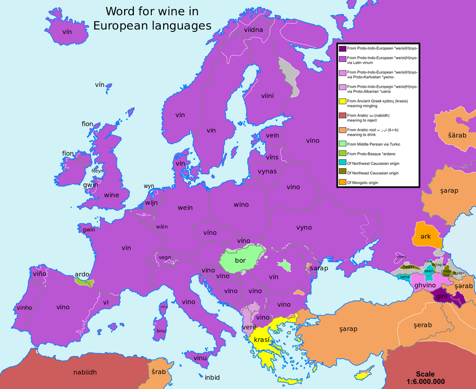
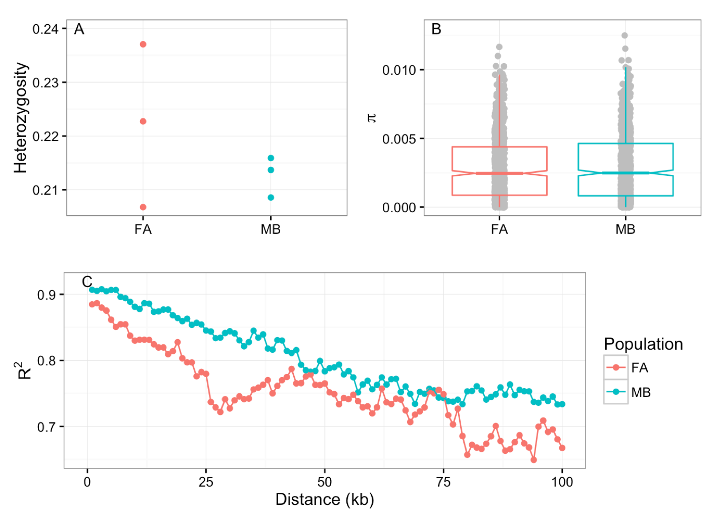
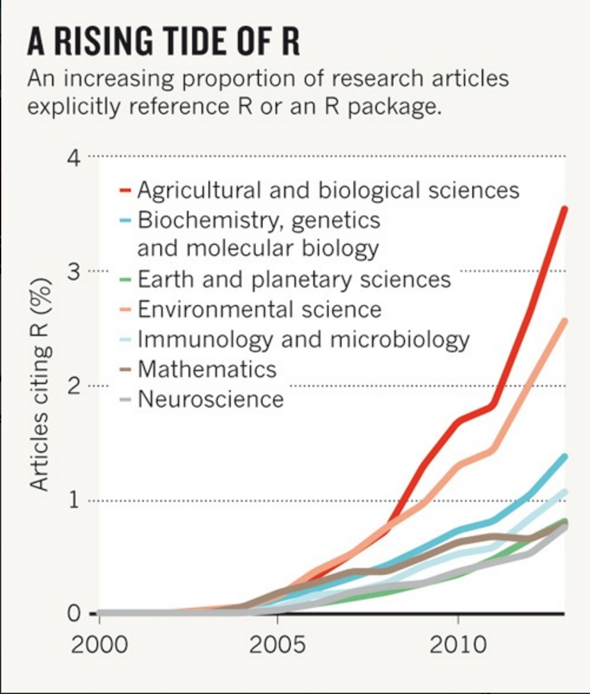
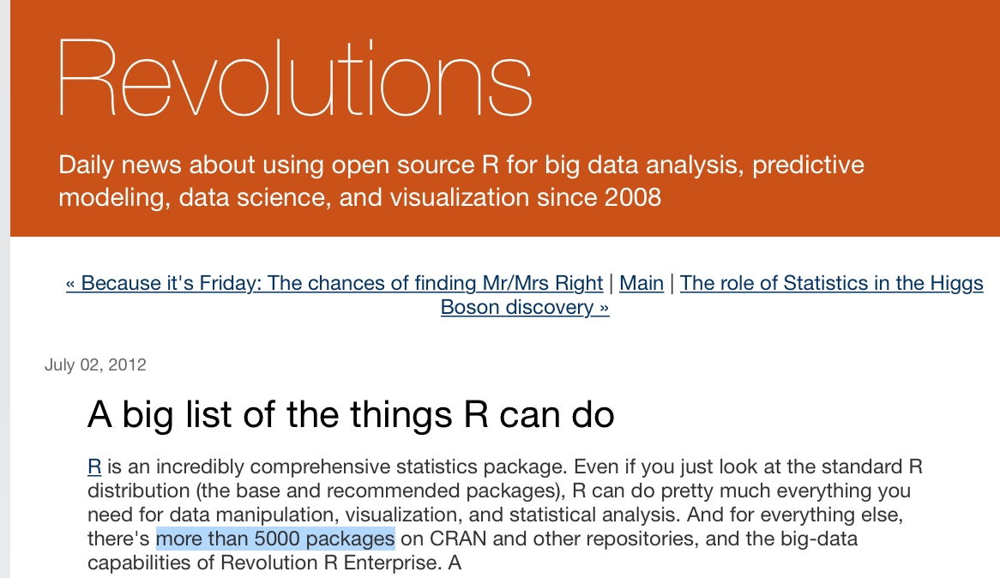
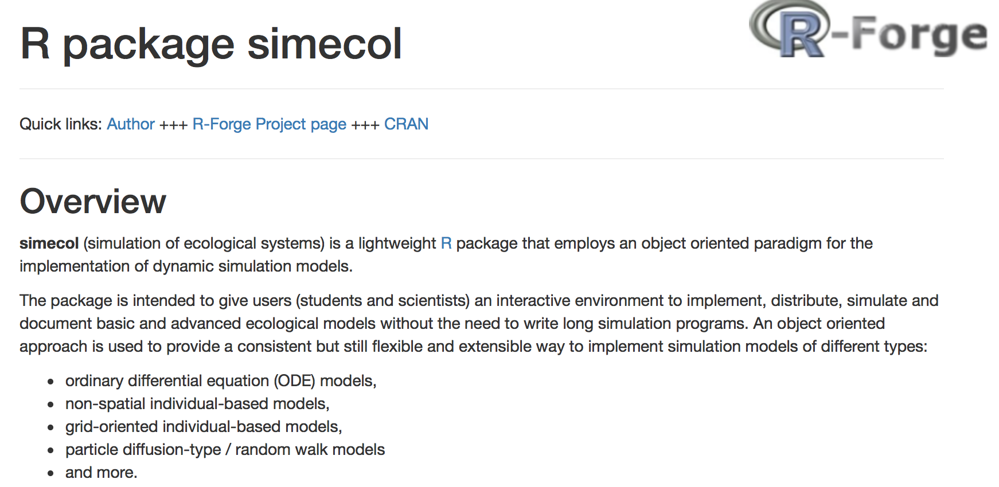
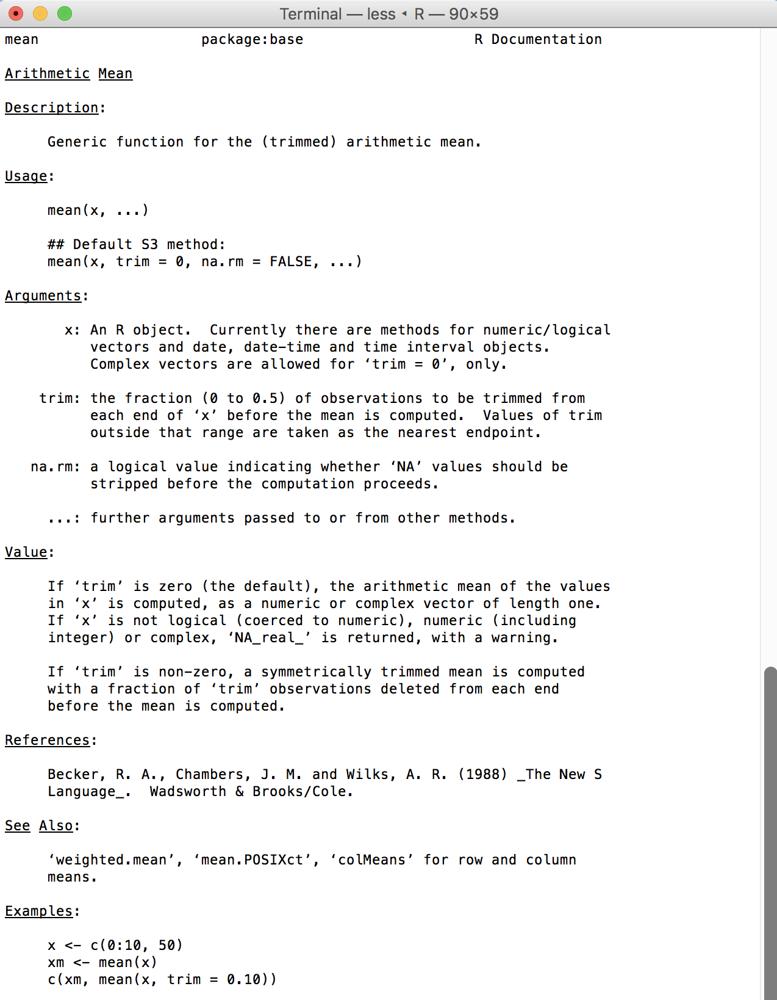
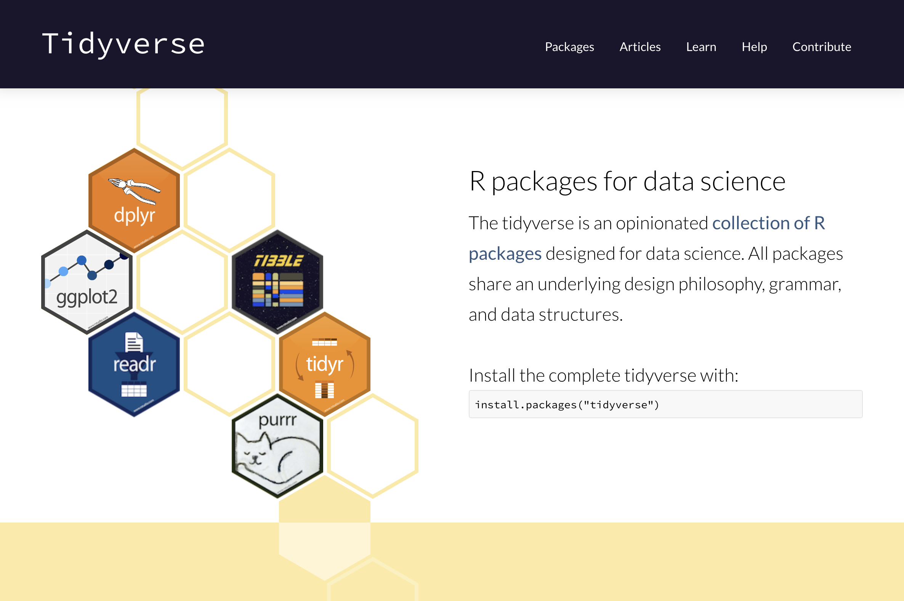
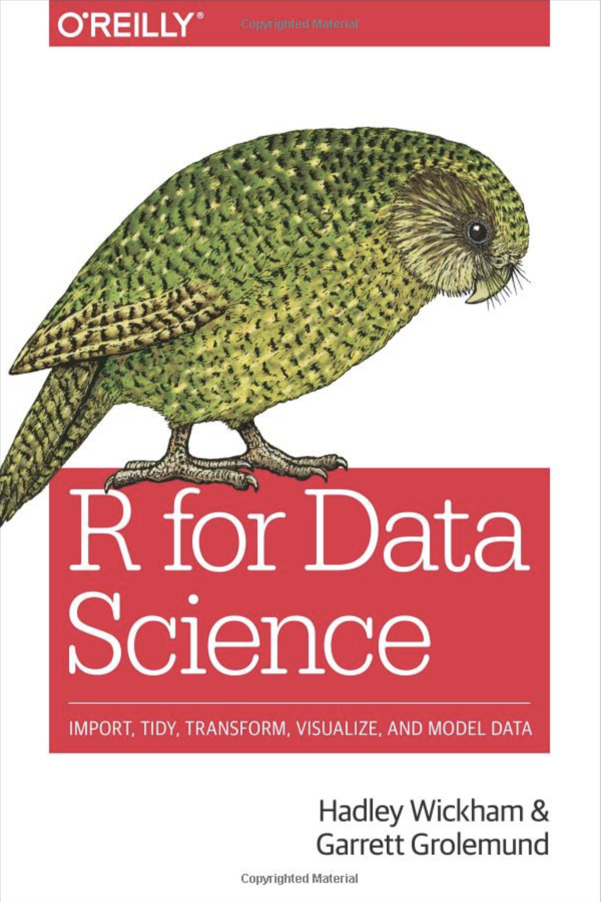

## Recap

Yesterday we learned...

- Bash
- (Perl)
- (Python)

Today...

- R!


# NOT ANOTHER BLOODY LANGUAGE


## Getting by with programming languages

<div align="center">

</div>


## Today we go from this...

```{r}
x <- 1 + 1
x
```


## To this...

<div align="center">

</div>


## Outline

- What is R and why is it so great?
- What does R do?
- How does R work?


# What is R?

## What is R?

R is an integrated suite of software facilities for data manipulation, calculation and graphical display. Among other things it has:

- an effective data handling and storage facility
- a large, coherent, integrated collection of tools for data analysis
- graphical facilities for data analysis and display
- a well developed, simple and effective programming language 

<div align="center">
<p style="font-size:12px">https://cran.r-project.org/doc/manuals/r-release/R-intro.pdf</p>
</div>


# Why use R?


## Why use R?

R is:

- Free
- Popular
- Powerful
- Flexible
- Well supported

<br>
<br>
<br>
<br>

<div align="center">
<p style="font-size:12px">https://www.r-bloggers.com/why-use-r-five-reasons/</p>
</div>


## R is free

- Users have the freedom to run, copy, distribute, study, change and improve the software.
- Free as in "free speech" not "free beer"
- Part of the GNU project (along with Linux, Gimp etc.)

<br>
<br>
<br>

<div align="center">
<p style="font-size:12px">https://www.gnu.org/</p>
</div>


## R is popular

<div align="center">

</div>

<div align="center">
<p style="font-size:12px">http://www.nature.com/news/programming-tools-adventures-with-r-1.16609</p>
</div>


## R is powerful
- Can handle big data
- Can perform complex simulations
- Can be used with High Performance Clusters


## R is flexible
<div align="center">

</div>

<br>
<br>

<div align="center">
<p style="font-size:12px">http://blog.revolutionanalytics.com/2012/07/a-big-list-of-the-things-r-can-do.html</p>
</div>


## R is well supported

- Extensive built-in help
- Tutorials with packages
- Stack overflow
- R bloggers
- Twitter (#Rstats)


# What does R do?


## What can I do in R?
- Simulate and generate data
- Read, process and manipulate data
- Data analysis and statistics
- Make beautiful plots and graphics
- Write papers, reports and presentations (R markdown)


## Simulate and generate data
```{r,fig.width = 4,fig.height = 4,fig.align='center'}
x <- rnorm(20,mean = 20,sd = 2.5)
y <- x + rnorm(20,mean = 0, sd = 0.5)
plot(x,y)
```


## Simulate and generate data

<div align="center">

</div>


## Read, process and manipulate data

- Read in text files and tables
- Reformat tables
- Add new variables
- Recode variables
- Condense data
- Summarise data
- Link data tables
- Check for errors
- Clean data


## Data analysis and statistics
- Linear models, mixed models
- Bayesian models
- Spatial analysis
- Phylogenetics
- Population genetics
- Quantitative genetics


# How does R work?


## Our aim

- Manipulate and analyse *numbers*
- Manipulate and analyse *text*

```{r, echo = F}
boxplot(weight~feed,data=chickwts,ylab = "Weight (g)",xlab = "Feed type",main = "Chick weights and feed type")
```


## R and Unix

<div align="center">

</div>


## R is a calculator

```{R}
4 + 7
```


## R objects

```{R,error = T}
x <- 4
x

rm(x)
x

```


## R objects

```{R}
x <- 4
x + 7

```


## R objects

```{R}
x <- 4
y <- 7
x + y

```


## Characters

```{R,error = T}
hello

"hello"

"hello world"
```


## Characters

```{R}
x <- "Martin has a bushy beard"
x
```


## Characters

```{R,error = T}
x <- "cats"
y <- "dogs"

x + y

"1" + "2"

```


## Vectors

```{R}
x <- c(6,7,8)
x

y <- c(1:10)
y

z <- c("cats","cats","dogs")
z

```


## Vectors

Vectors can consist of numbers or characters, but not both


```{R}

x <- c(1,2,"cats")
x

```


## Vectors

```{R}
x <- c(1:10)
x/2

y <- c(101:110)
z <- x*y
z
```


## Vectors

```{R}
x <- c(1,2,4,4,4,5)

x[5]
x[c(4:6)]

```


## Vectors

```{R}
x <- "Martin has a bushy beard"
x[1]
x[2]
```


## Vectors

```{R}
x <- c("Martin","has","a","bushy","beard")
x[1]
x[2]
x[c(3:5)]
```


## Matrices

```{R}
x <- matrix(0,ncol = 6,nrow = 2)
x

x <- matrix(c(1:12),ncol = 4,nrow = 3)
x
```


## Matrices

```{R}

x <- c("cats","cats","cats","cats","dogs","dogs")
m <- matrix(x,
            ncol = 3,nrow = 2)
m

m <- matrix(x,
            ncol = 3,nrow = 2,byrow = T)
m
```


## Matrices

```{R}
m
m[2,]
m[,3]
```


## Matrices

```{R}
m
m[2,3]
```


## Functions

- `c()`, and `matrix()` are *functions*.
- Arguments for functions always enclosed within brackets after function name
- Can be built-in or written ourselves


## Some useful functions

```{R}
x <- seq(from = 0,to = 1000,by = 100)
str(x)
sum(x)
length(x)

```


## Functions

```{R}
?mean
```

<div align="center">

</div>


## Factors
```{R}

x <- c("red","red","red","blue","blue","green")
str(x)

x1 <- factor(x)
str(x1)
```


## Data frames

```{R}
Sweet_colours <- c("Red","Purple","Yellow","Green")
Number_eaten <- c(21,18,3,4)
Number_left <- c(0,1,20,23)

sweets <- data.frame(Sweet_colours,Number_eaten,Number_left)

sweets
```


## Data frames

```{R}
str(sweets)

nrow(sweets)

ncol(sweets)
```


## Data frames

```{R}
sweets[2,]
sweets[,2]
sweets[2,2]
```


## Data frames

```{R}
sweets$Sweet_colours
sweets[,"Sweet_colours"]
```


## Data frames

```{R,fig.width = 5,fig.height = 4,fig.align = "center"}
plot(Number_left~Number_eaten,data = sweets,
     xlab = "Number of sweets eaten",
     ylab = "Number of sweets left")
```


## R scripts

`Rscript`

```{r eval = F}
quit()

nano
<write your R script>

Rscript myscript.R
```


# Tidyverse


## Tidyverse

<div align="center">

</div>

<div align="center">
<p style="font-size:12px">https://www.tidyverse.org/</p>
</div>


## Tidyverse - reading and data formats

*readr*

"a fast and friendly way to read rectangular data (like csv, tsv, and fwf). It is designed to flexibly parse many types of data found in the wild, while still cleanly failing when data unexpectedly changes."

<br>

*tibble*

"a modern reimagining of the data frame, keeping what time has proven to be effective, and throwing out what is not. Tibbles are data.frames that are lazy and surly: they do less (i.e. they don’t change variable names or types, and don’t do partial matching) and complain more (e.g. when a variable does not exist)."


## Tidyverse - data wrangling

*dplyr*

"a grammar of data manipulation, providing a consistent set of verbs that help you solve the most common data manipulation challenges"

<br>

*tidyr*

"The goal of tidyr is to help you create tidy data. Tidy data is data where: each variable is in a column, each observation is a row, each value is a cell."


## Tidyverse - programming and plotting

*purrr*

"purrr enhances R’s functional programming (FP) toolkit by providing a complete and consistent set of tools for working with functions and vectors."

*ggplot2*

"ggplot2 is a system for declaratively creating graphics, based on The Grammar of Graphics. You provide the data, tell ggplot2 how to map variables to aesthetics, what graphical primitives to use, and it takes care of the details."


## Tidyverse - help

<div align="center">

</div>

<div align="center">
<p style="font-size:12px">https://r4ds.had.co.nz/</p>
</div>


# Your turn


## Your turn
- Open *Intro_to_R_practical.pdf*
- Follow the instructions!

