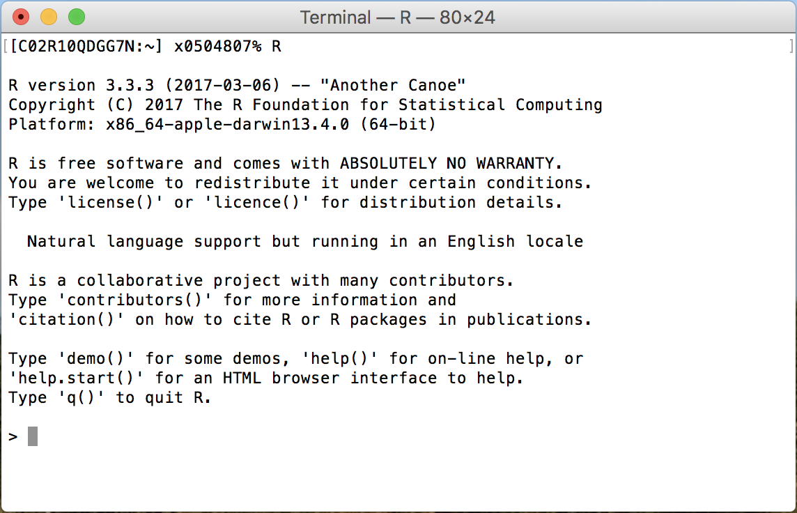
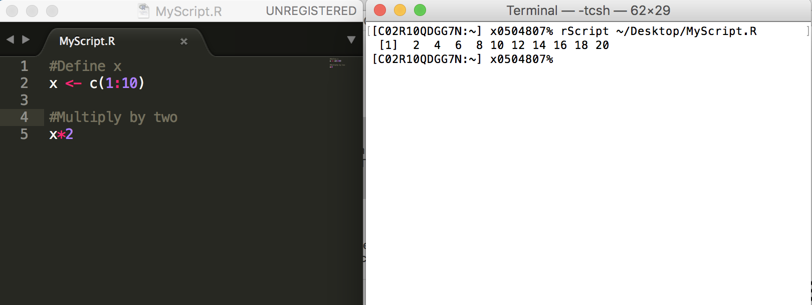
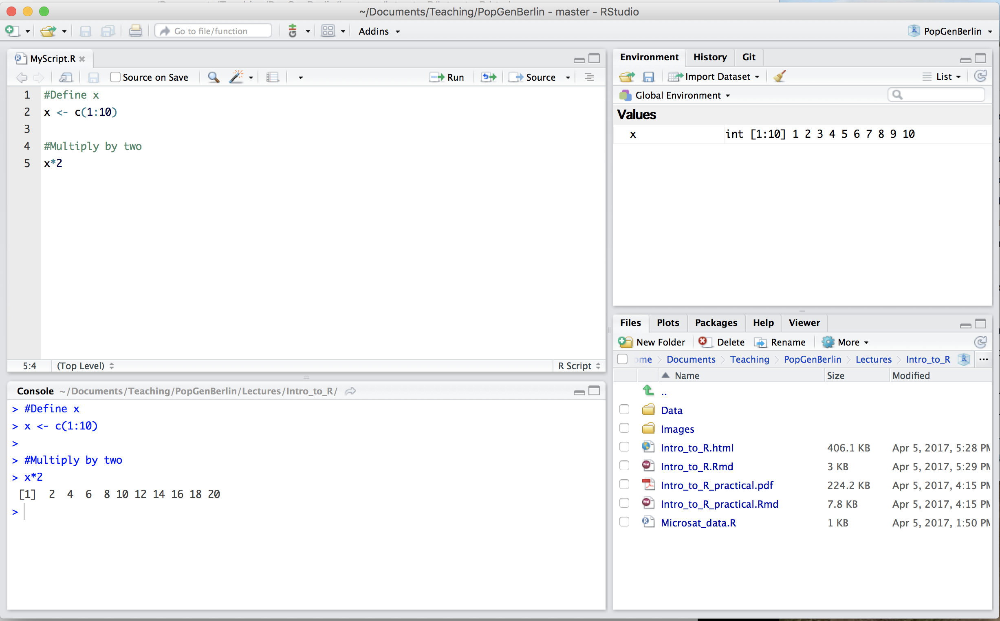

##Outline

- What is R and why is it so great?
- What does R do?
- How does R work?


#What is R and why is it so great?

## What is R?

R is an integrated suite of software facilities for data manipulation, calculation and graphical display. Among other things it has:

- an effective data handling and storage facility
- a large, coherent, integrated collection of tools for data analysis
- graphical facilities for data analysis and display
- a well developed, simple and effective programming language 

<div align="center">
<p style="font-size:12px">https://cran.r-project.org/doc/manuals/r-release/R-intro.pdf</p>
</div>

## Why use R?

R is:

- Free
- Popular
- Powerful
- Flexible
- Well supported

<br>
<br>
<br>
<br>

<div align="center">
<p style="font-size:12px">https://www.r-bloggers.com/why-use-r-five-reasons/</p>
</div>


## R is free

- Users have the freedom to run, copy, distribute, study, change and improve the software.
- Free as in "free speech" not "free beer"
- Part of the GNU project (along with Linux, Gimp etc.)

<br>
<br>
<br>

<div align="center">
<p style="font-size:12px">https://www.gnu.org/</p>
</div>


## R is popular

<div align="center">

</div>

<div align="center">
<p style="font-size:12px">http://www.nature.com/news/programming-tools-adventures-with-r-1.16609</p>
</div>


##R is powerful
- Can handle big data
- Can perform complex simulations
- Can be used with High Performance Clusters


##R is flexible
<div align="center">

</div>

<br>
<br>

<div align="center">
<p style="font-size:12px">http://blog.revolutionanalytics.com/2012/07/a-big-list-of-the-things-r-can-do.html</p>
</div>


##R is well supported

- Extensive built-in help
- Tutorials with packages
- Stack overflow
- R bloggers
- Twitter (#Rstats)


#What does R do?


##What can I do in R?
- Simulate and generate data
- Read, process and manipulate data
- Data analysis and statistics
- Make beautiful plots and graphics
- Write papers, reports and presentations (R markdown)


##Simulate and generate data
```{r,echo = F,fig.width = 5,fig.height = 5,fig.align='center'}
x <- c(1:20)
y <- x + rnorm(20,sd = 2.5)
plot(x,y)
```


##Simulate and generate data

<div align="center">

</div>


##Read, process and manipulate data

- Read in text files and tables
- Reformat tables
- Add new variables
- Recode variables
- Condense data
- Summarise data
- Link data tables
- Check for errors
- Clean data


##Data analysis and statistics
- Linear models, mixed models
- Bayesian models
- Spatial analysis
- Phylogenetics
- Population genetics
- Quantitative genetics


#How does R work?


## R and Unix

<div align="center">

</div>


## R is a calculator

```{R}
4 + 7
```


##R objects

```{R,error = T}
x <- 4
x

rm(x)
x

```


##R objects

```{R}
x <- 4
x + 7

```


##R objects

```{R}
x <- 4
y <- 7
x + y

```


##Vectors

```{R}
x <- c(6,7,8)
x

x <- c(1:10)
x

```


##Vectors

```{R}
x <- c(1:10)
x + 1
x/2

y <- c(101:110)
x*y

```


##Vectors

```{R}
x <- c(1:10)
x + 1
x/2

y <- c(101:110)
x*y

```


##Vectors

```{R}
x <- c(1,2,4,4,4,5)

x[5]
x[c(4:6)]

```


##Functions

```{R}
x <- c(1,2,4,4,4,5,11)
sum(x)
length(x)
sum(x)/length(x)
mean(x)


```


##Functions

```{R}
?mean
```

<div align="center">

</div>


##Characters

```{R,error = T}
hello
```

```{R,error = T}
"hello"

"hello world"
```


##Characters

```{R}
x <- "Martin has a bushy beard"
x
```


##Characters

```{R}
x <- "Martin has a bushy beard"
x[1]
x[2]
```


##Characters

```{R}
mb <- c("Martin","has","a","bushy","beard")
mb[1]
mb[2]
mb[c(3:5)]
```


##Data frames

```{R}
Sweet_colours <- c("Red","Purple","Yellow","Green")
Number_left <- c(0,1,20,23)

sweets <- data.frame(Sweet_colours,Number_left)

sweets
```


##Data frames

```{R}
str(sweets)

nrow(sweets)

ncol(sweets)
```


##Data frames

```{R}
sweets$Sweet_colours
sweets$Number_left
```

##Data frames

```{R}
sweets[2,]
sweets[,2]
sweets[2,2]
```


##Data frames

```{R}
barplot(height = sweets$Number_left,names.arg = sweets$Sweet_colours)
```


## R scripts

`rScript`

<div align="center">

</div>

## R studio
<div align="center">

</div>


#Your turn

##Your turn
- Open R studio
- Type a simple calculation into the console (e.g. `4*4`)
- Now click File > New file > R script
- In your script, create a named vector (e.g. `x <- c(1:10)`)
- On a new line write a command to perform a calculation on your object (e.g. `x/10`)
- Try running a line at a time (ctrl + enter)
- Try running the whole script (select all then ctrl + enter)
- Add some comments to your script

##Your turn
- Open *Intro_to_R_practical.pdf*
- Read the instructions
- Follow the instructions
- Green sticky note if you are finished
- Red sticky note if you are stuck