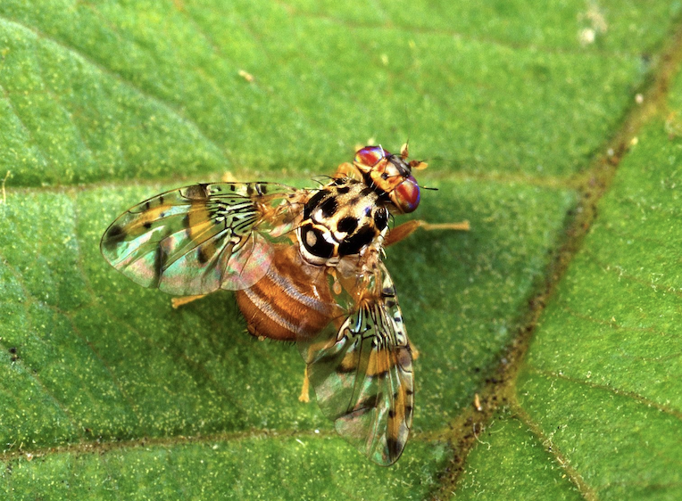
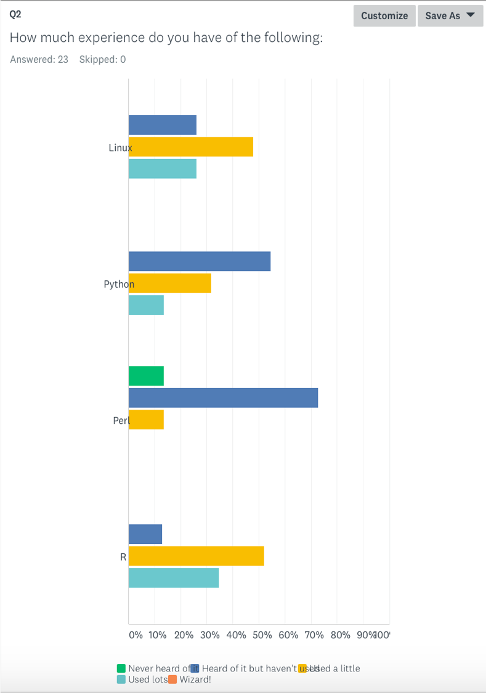
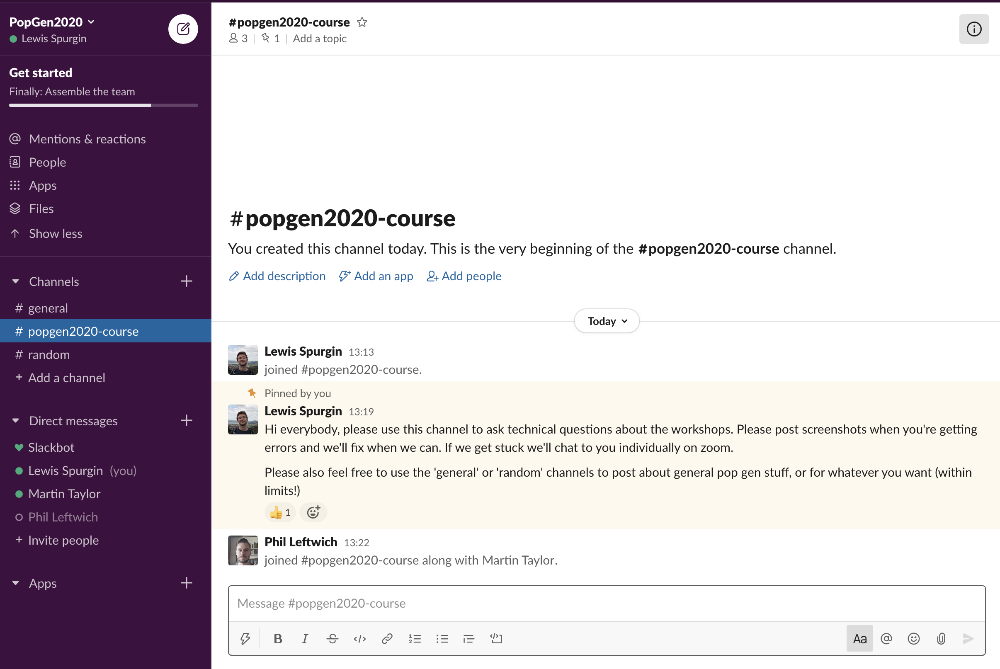

```{r setup, include=FALSE}
knitr::opts_chunk$set(echo = FALSE, message = FALSE)
library(tidyverse)
library(knitr)
library(kableExtra)
```

## Welcome to "Berlin"!

<div align="center">

</div>

## Plan

```{r}
df <- tibble(Time = c("13:00-14:30","14:30-15:00","15:00-16:30","16:30-17:30","17:30-19:00","19:00-19:30","19:30-21:00"),
             Monday = c("Intro and logging on","COFFEE","Intro to Linux","LUNCH","Linux/file formats","COFFEE","File formats"),
             Tuesday = c("Intro to R","COFFEE","Intro to R","LUNCH","Genetic diversity","COFFEE","Genetic diversity"),
             Wednesday = c("Population structure","COFFEE","Population structure","LUNCH","Hybridisation and introgression","COFFEE","Hybridisation and introgression"),
             Thursday = c("Selection 1","COFFEE","Selection 1","LUNCH","Selection 2","COFFEE","Selection 2"),
             Friday = c("Landscape genomics","COFFEE","Landscape genomics","LUNCH","Own data beer/help session","BEER","Own data beer/help session"))

kable(df) %>%kable_styling(bootstrap_options = c("striped", "hover"),font_size = "12") %>%
  footnote(general = "Times are in CEST")

```

## Who we are | Lewis Spurgin

- Mainly birds and insects
- Population genomics
- Ecological adaptation
- Population demography
- Conservation and pest management


<div align="right">

</div>


## Who we are | Martin Taylor

- Mainly fish and aquatic organisms
- Population genetics and genomics
- Traceability, aquaculture and fisheries
- Evolutionary biology
- Phylogenetics and phylogenomics

<div align="center">

</div>


## Who we are | Phil Leftwich

- Mainly insect pests
- Gene drives and genetic technology
- Molecular biology
- Statistics and computing

<div align="right">

</div>


## Norwich

<div align="left">

</div>


## University of East Anglia


<div align="center">

</div>

## Who are you?

- 32 participants with very varied backgrounds
- Different levels of experience and expertise
- Different expectations from the course


## Who are you?

<div align="center">

</div>


## Who are you?

<div align="center">

</div>


## Who are you?

<div align="center">

</div>


## Your interests

<div align="center">

</div>


## What the course is

- Introduction to population genomics
- Conceptual and practical
- Designed to take you through a range of population genomic analyses
- Broad rather than deep in any one area
- Opportunity to network with peers
- Opportunity to work with your own data at the end of the course


## What we won't cover
- SNP calling
- Phylogenomics
- Annotation of genes / blast related activities
- Transcriptomics
- Genome assembly / scaffolding / annotation


## What we will do

- Provide you with background theory and introduce methods
- Introduce you to which programmes do what and how to use them
- Provide step-by-step guides to practical work
- Be here to help...


## What we won't do

<div align="center">

</div>

## What we won't do

<div align="center">

</div>


# Some specifics


## Format of workshops

- Typically one lecture and one practical per session
- Practicals will take majority of the time
- Mainly working with example data
- Emphasis on discussion and peer learning throughout


## Practical sessions

- Timing may be fluid depending on the pace we work through the different sessions
- Some of them you may not finish, but you can continue on your own time
- If you do finish, there are open-ended tasks at the end. Use these to explore and develop the new skills you have learned


## The Amazon instance

- We will be working from the Amazon EC2 cloud
- We will go through the process of logging in in the next session
- We will be using a mixture of cloud based and laptop based analyses
- This will involve downloading files from the cloud to your laptops


## Data files

- All data files will be provided
- Files for each session will be in a folder called Dati
- You have a short cut in your home folder
- Own data on Friday


## Workshop htmls

<div align="center">

</div>

- We will post the html files on slack each morning before the workshop


## General workshop guidance

- Don't just copy and paste commands from the html - type them in
- Use help files, the internet and each other
- Use the "show answer" button on the html files if you are stuck
- Use the instructors if you are still stuck


## Getting help
- Use the popgen2020-course slack channel
- Try to be as clear and detailed as possible when asking for help
- (Other slack channels for general chat)

<div align="center">

</div>


## Getting help

- Questions after lectures (zoom chat/using mic)
- Workshops will use zoom breakout rooms
- We will visit the breakout rooms


## Managing expectations
- You will not become experts from scratch in 1 week
- We will give you a broad introduction to many of the types of analyses and data sets you will encounter
- Provide you with the skills to analyse datasets on your own
- You never stop learning

