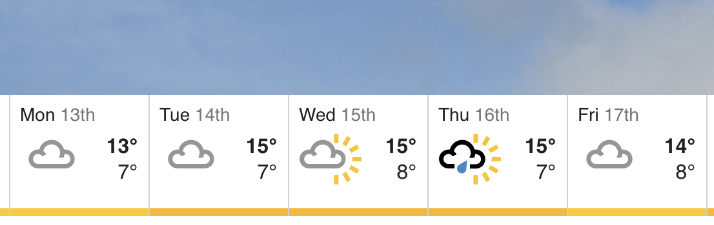
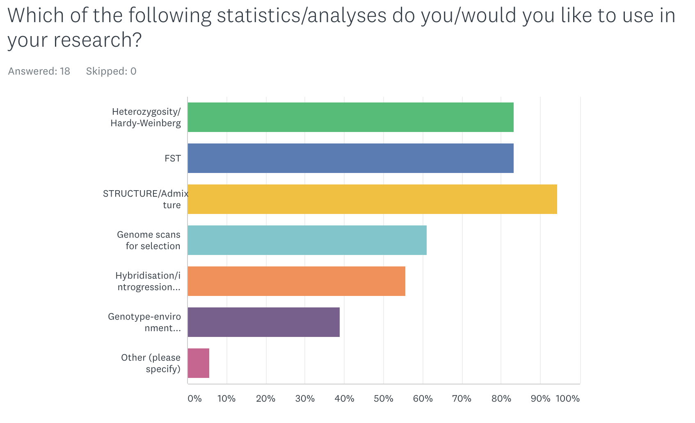

```{r setup, include=FALSE}
knitr::opts_chunk$set(echo = FALSE)
```

##Welcome to Berlin!

<div align="centre">

</div>

##Plan - Mon-Tues

<div align="centre">

</div>

##Plan - Wed-Fri

<div align="centre">

</div>


##Who we are | Martin Taylor

- Mainly fish and aquatic organisms
- Population genetics and genomics
- Traceability, aquaculture and fisheries
- Evolutionary biology
- Phylogenetics and phylogenomics

<div align="centre">

</div>


##Who we are | Lewis Spurgin

- Mainly birds and insects
- Population genomics
- Ecological adaptation
- Population demography
- Conservation and pest management


<div align="right">

</div>


##Norwich

<div align="left">

</div>


## University of East Anglia


<div align="center">

</div>

##Who are you?

- 21 participants with very varied backgrounds
- Very different levels of experience and expertise
- Different expectations from the course


##Where are you from?

<div align="center">

</div>


##Who are you?

<div align="center">

</div>


##Who are you?

<div align="center">

</div>


##Your interests

<div align="center">

</div>


##What the course is

- Introduction to population genomics
- Conceptual and practical
- Designed to take you through a range of population genomic analyses
- Broad rather than deep in any one area
- Opportunity to network with peers
- Opportunity to work with your own data at the end of the course


##What we won't cover
- SNP calling
- Phylogenomics
- Annotation of genes / blast related activities
- Transcriptomics
- Genome assembly / scaffolding / annotation


##What we will do

- Provide you with background theory and introduce methods
- Introduce you to which programmes do what and how to use them
- Provide step-by-step guides to practical work
- Be here to help...


##What we won't do

<div align="center">

</div>

##What we won't do

<div align="center">

</div>


#Some boring specifics


##Format of workshops

- Typically one lecture and one practical per session
- Practicals will probably take majority of the time
- Mainly working with example data
- Emphasis on discussion and peer learning throughout


##Practical sessions

- Timing may be fluid depending on the pace we work through the different sessions
- Some of them you may not finish, but you can continue on your own time
- If you do finish, there are open-ended tasks at the end. Use these to explore and develop the new skills you have learned


##The Amazon instance

- We will be working from the Amazon EC2 cloud
- We will go through the process of logging in in the next session
- We will be using a mixture of cloud based and laptop based analyses
- This will involve downloading files from the cloud to your laptops


##Data files

- All data files will be provided
- Files for each session will be in a folder called Dati
- You have a short cut in your home folder
- Own data on Friday


##Workshop htmls

<div align="center">

</div>

- We will email you the html files each morning before the workshop


##General workshop guidance

- Don't just copy and paste commands from the html - type them in
- Use help files, the internet and each other
- Use the "show answer" button on the html files if you are stuck
- Use the instructors if you are still stuck


##Managing expectations
- You will not become experts from scratch in 1 week
- We will give you a broad introduction to many of the types of analyses and data sets you will encounter
- Provide you with the skills to analyse datasets on your own
- You never stop learning

