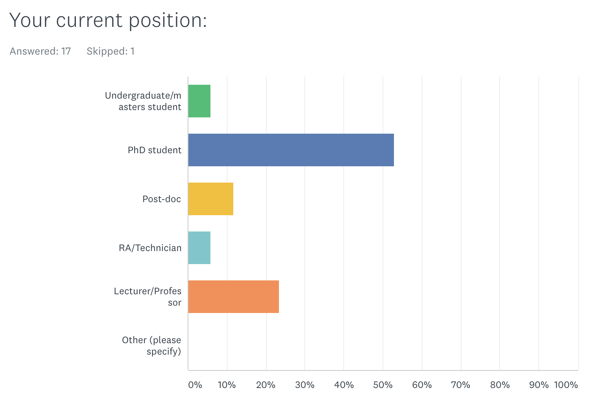
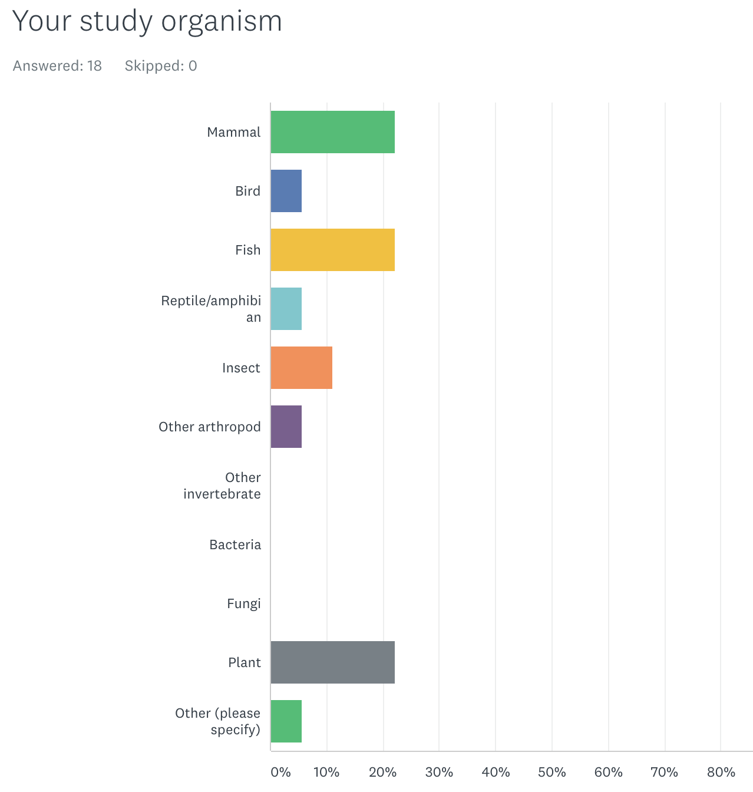

```{r setup, include=FALSE}
knitr::opts_chunk$set(echo = FALSE)
```

##Welcome to Berlin!

<div align="centre">

</div>

##Plan - Mon-Tues

<div align="centre">

</div>

##Plan - Wed-Fri

<div align="centre">

</div>


##Who we are | Martin Taylor

- Mainly fish / aquatic organisms
- Population genetics/ genomics
- Traceability / aquaculture / fisheries
- evolutionary biology
- phylogenetics/phylogenomics

<div align="centre">

</div>


##Who we are | Lewis Spurgin

- Mainly birds and insects
- Population genomics
- Ecological adaptation
- Population demography
- Conservation/pest management


<div align="right">

</div>


##Norwich

<div align="left">

</div>


## University of East Anglia


<div align="center">

</div>

##Who you are

- 21 participants with very varied backgrounds
- Very different levels of experience and expertise
- Probably have different expectations from the course
- You can learn lots from each other!

##Where are you from?

<div align="center">

</div>


##Who are you?

<div align="center">

</div>

##Who are you?

<div align="center">

</div>


##What the course is

- Introduction to population genomics
- Designed to take researchers through a range of basic analyses
- Broad rather than deep in any one area
- Opportunity to network with peers
- Mainly working with example data
- Opportunity to work with your own data at the end of the course


##Format of workshops

- Typically one lecture per session
- Practical component using class data files


##What we won't do

<div align="center">

</div>

##What we won't do

<div align="center">

</div>


##What we will do

- Provide you background theory / examples / methods in lectures
- Practical level - which programmes do what and how to use them
- Be here to help...


##Your interests

<div align="center">

</div>


##What we won't cover
- SNP calling
- Phylogenomics
- Annotation of genes / blast related activities
- Transcriptomics
- Genome assembly / scaffolding / annotation


##Matching your expectations
- You will not become experts from scratch in 1 week!
- We will give you a broad introduction to many of the types of analyses and data sets you will encounter
- Provide you with the skills to analyse data sets on your own
- You never stop learning!


##Data files

- All data files will be provided
- Files for each session will be in a folder called Dati
- You have a short cut in your home folder
- Own data on Friday or among yourselves during the week
- by the end of the week you should be able to run analyses on your own data sets

##The Amazon instance

- We will be working from the Amazon EC2 cloud
- We will go through the process of logging in in the next session
- We will be using a mixture of cloud based and laptop based analyses
- This will involve downloading files from the cloud to your laptops

##Workshops

- Each workshop will cover a different set of topics
- Timing may be quite fluid depending on the relative pace we work through the different sections
- Some of them you may not finish, but you can continue on your own time


##Workshop htmls

<div align="center">

</div>

- You will have print outs of each workshop and html also available
- We will email you the html files each morning before the workshop


##General workshop guidance

- Try and use just the printouts i.e. don't just copy and paste commands from the html if you can help it
- Typing commands will help you to better understand what each command and option does. It will be slower, but much better for you!
- Use help files, the internet and each other
- Use the "show answer" button on the html files if you are stuck
- Use the instructors if you are still stuck!

