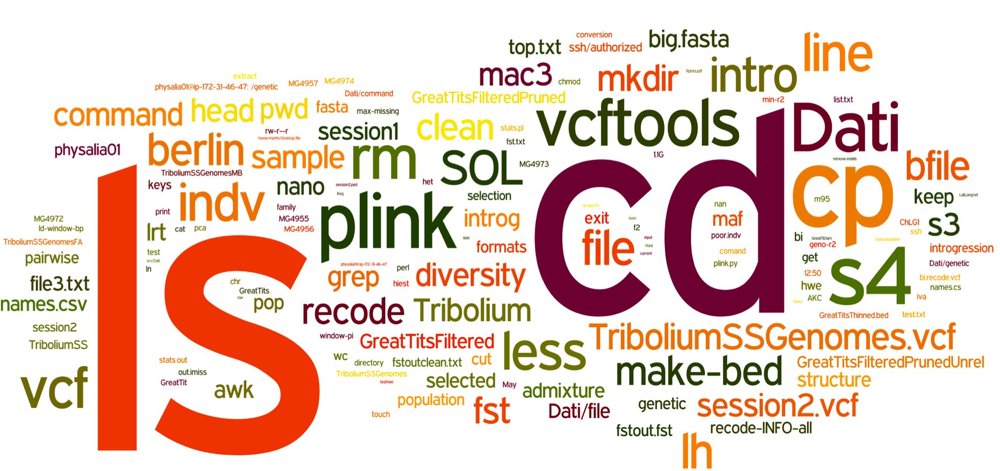
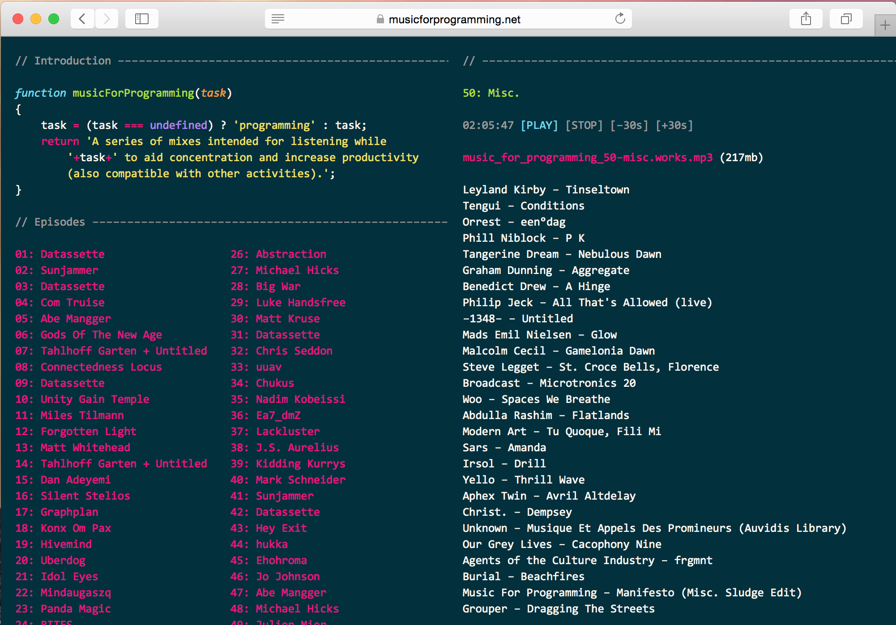
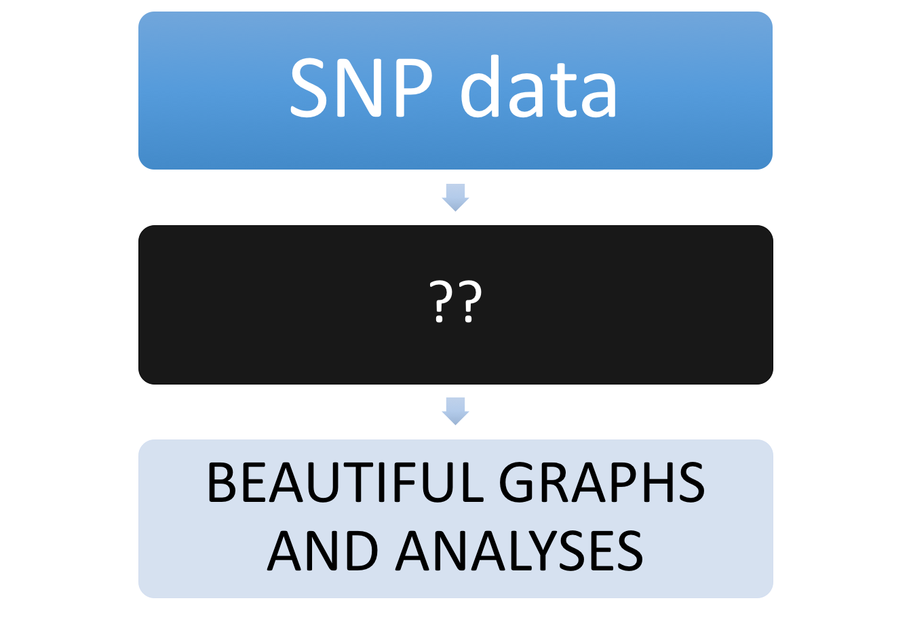
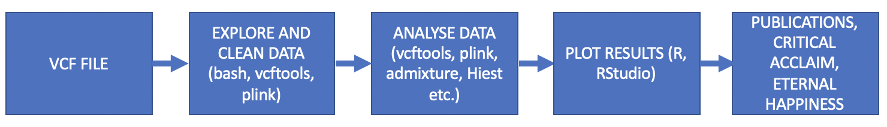
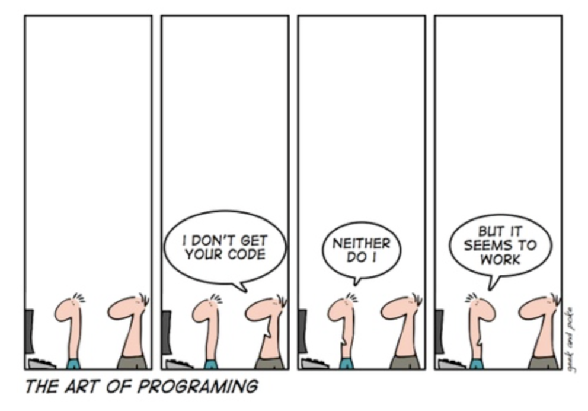

## Round-up

- What have you been doing this week?
- What next?

#What have we covered

## What we have covered | Linux and the command line
- Logging onto a server (`ssh`)
- Downloading files and folders (`scp`!! `pscp`!!)
- Navigating, creating, deleting folders and files (`cd`, `mkdir`, `rm`)
- Viewing and editing files (`less`, `cat`, `head`)
- Summarising files (`wc`, `ls`)
- Manipulating files (`grep`, `awk`, `cut`)
- Writing files (`>`, `nano`)

----
 
 

## What we have covered | R
- Reading in files (`read.table()`,`read.csv()`)
- Manipulating files (`as.numeric()`,`subset()`,`rbind()`)
- Performing calculations (`mean()`)
- Summarising data (`table()`,`ddply()`,`for()`)
- Making lovely graphs (`plot()`,`ggplot()`)

## What have we covered | Other software
- VCFtools (filtering, genetic variation, selection)
- Plink (filtering, genetic variation, selection, population structure)
- Admixture (population structure, identifying hybrids)
- HiEst (identifying hybrids)
- ABBA-BABA (identifying introgression)
- EigenGWAS (identifying selection)
- BayEnv (genotype-environment association)

## What have we covered

#A roadmap for population genomics analysis (post SNP-calling)

##Population genomic analysis

 

##Population genomic analysis

#What next?

##What next

**NOW:** Have a break!

**AFTER 1 WEEK:** Have another look at one of the workshops that interested you. Make sure you understand it.

**AFTER 2 WEEKS:** Try to apply some of the analyses you have learned in the course to your own dataset

##What next | General tips

- **Practise**, practise, practise!
- **Work** with expert programmers (if they will let you!)
- **Listen and Learn** from how others do things, even if they are less experienced than you. 
- **Read** about new developments and best practices (blogs, discussion groups, Twitter, etc.)

##What next?

- Talk to each other (Google Groups)
- Ask us (but not too much!)

##What next?

