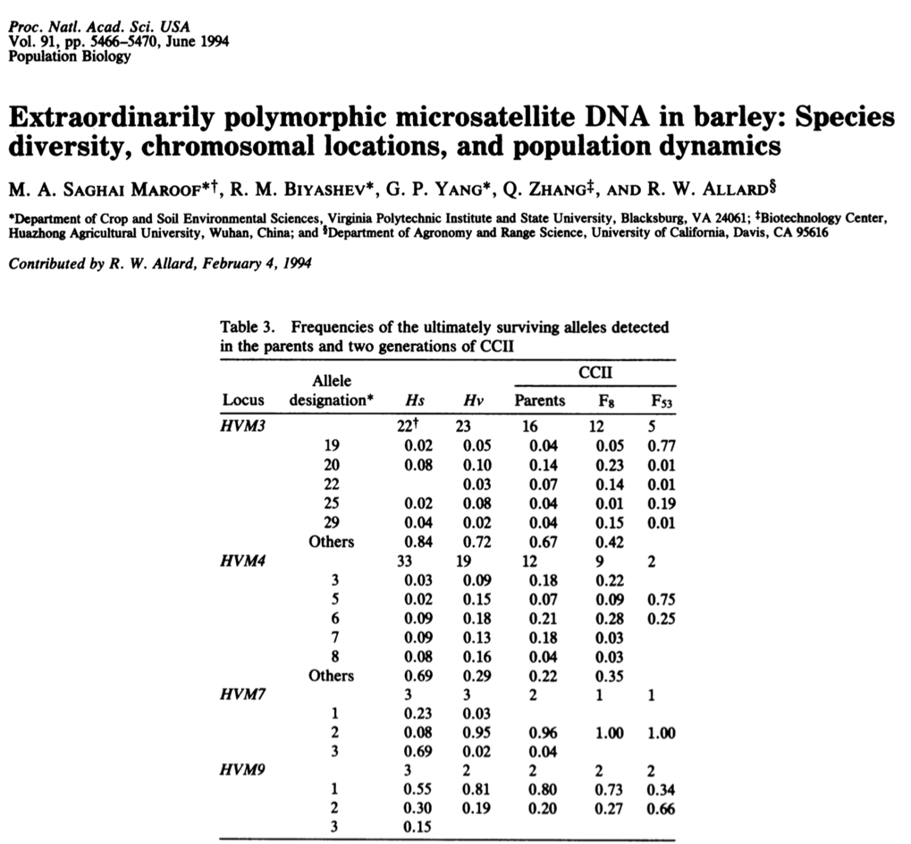

```{r setup, include=FALSE}
knitr::opts_chunk$set(echo = FALSE)
```

##Outline
- Historical overview
- Natural selection in the (population) genomic era
- Software and tools

#Historical overview


##Evolution by natural selection

<br>

*"To my imagination it is far more satisfactory to look at such instincts as the young cuckoo ejecting its foster-brothers, ants making slaves, the larvæ of ichneumonidæ feeding within the live bodies of caterpillars, not as specially endowed or created instincts, but as small consequences of one general law, leading to the advancement of all organic beings, namely, multiply, vary, let the strongest live and the weakest die."*

Darwin, *The Origin of Species*

## The modern synthesis
<div align = "center">

</div>

## Natural selection and genetic variation

- How much of the genome is subject to natural selection?
- Which parts are affected? What do they do?
- How does natural selection affect genetic variation?


## Natural selection and genetic variation
<div align = "left">

</div>


## Natural selection and genetic variation

<div align = "center">

</div>


## Genetic variation in populations

<div align = "center">

</div>


## Neutral theory
<div align = "center">

</div>

## Selectionism vs neutralism

- Most genetic variation is neutral or deleterious
- Most genetic variation is positively selected

**Who is right?**

## Selectionism vs neutralism

The neutralists think - rightly in my opinion - that adaptations are the tip of the iceberg: probably most evolutionary change, when seen at the molecular level, is non-functional.


## Can we find the tips of the iceberg?

<div align = "center">

</div>


## Can we find the tips of the iceberg?

<div align = "center">

</div>


## Can we find the tips of the iceberg?

<div align = "center">

</div>


# Natural selection in the (population) genomic era


# What can more markers tell us about natural selection?


## What can more markers tell us about natural selection?

We can take two approaches...

- Identify the genetic basis of known adaptive traits (top-down approaches)
- Identify loci under selection, then see what they do (bottom-up approaches)


## Bottom up approaches are not new

<div align = "center">

</div>


## Bottom-up approaches to detecting selection

<div align = "center">

</div>


## Bottom-up approaches to detecting selection

<div align = "center">

</div>


## Bottom-up approaches to detecting selection

<div align = "center">

</div>


## Detecting selection within populations

$\pi$

Nucleotide diversity (we know this!)


## Detecting selection within populations

$d_{N}/d_{S}$

Rate of non-synonynous compared to synonymous substitutions


## Detecting selection within populations

Tajima's $D$

https://www.youtube.com/watch?v=wiyay4YMq2A


## Detecting selection within populations

ROH

Runs of homozygosity

Long stretches of consecutive homozygous genotypes


## Detecting selection within populations

$iHS$

Integrated haplotype score

The amount of extended haplotype homozygosity (EHH) at a given SNP along the ancestral allele relative to the derived allele. 


## Detecting selection across populations

$F_{ST}$

We know this!


## Detecting selection across populations

$Rsb$

A comparison of extended haplotype homozygosity across two populations


## Detecting selection across populations

Ordination-based methods (e.g. EigenGWAS)

Perform a GWAS on a principal component analysis


## Bottom-up approaches to detecting selection

Combine signals from multiple statistics!

<div align = "center">

</div>


##Issues

<div align = "center">

</div>


#Software


##Software

- Plink (again!)
- VCFtools (again!)
- R (again!)
- Bayescan
- Lositan
- EigenGWAS
- pcaadapt